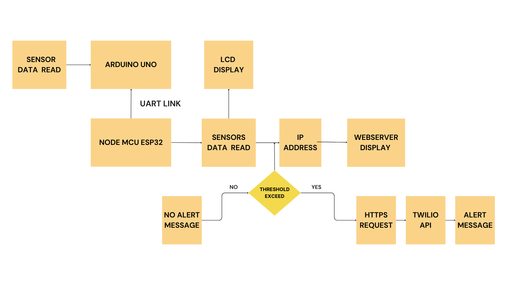
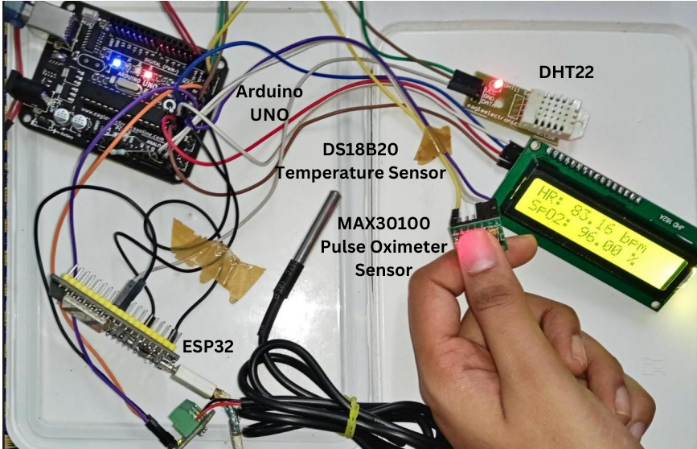

# IoT-Based Healthcare Monitoring with Real-Time Alerts via Twilio API

## Overview
This project focuses on developing an **IoT-Based Healthcare Monitoring System** that continuously tracks vital health parameters and sends real-time alerts when critical thresholds are exceeded.In this system the ESP32 is responsible for gathering environmental data, while the Arduino Uno handles the processing of heart rate and SpO2 readings from the MAX30100
sensor. The data is transmitted from the Arduino Uno to the ESP32 via a UART communication link, ensuring smooth and reliable data exchange between the two microcontrollers. The ESP32 consolidates all the collected data, including body
temperature, room temperature, humidity, heart rate, and SpO2 levels, and prepares it for display on the web server. This integration ensures seamless communication and accurate data representation for caregivers.

### Block Diagram

## Features
- **Real-time health monitoring** through an ESP32 web server.
- **Multi-sensor integration** for comprehensive health tracking:
  - **DS18B20**: Measures body temperature.
  - **DHT22**: Monitors environmental temperature and humidity.
  - **MAX30100**: Tracks heart rate and blood oxygen (SpO₂).
- **Twilio API integration** for instant SMS alerts when readings exceed critical thresholds.
- **Remote access,Cost-effective and scalable** solution for home healthcare and remote patient monitoring.

## Components Used
- **Microcontroller**: ESP32,Arduino UNO
- **Sensors**:
  - DS18B20 - Body Temperature Sensor
  - DHT22 - Environmental Humidity & Temperature Sensor
  - MAX30100 - Pulse Oximeter (Heart Rate & SpO₂)
- **Communication Protocols**:
  - I2C (MAX30100)
  - One-Wire (DS18B20)
- **Software & APIs**:
  - Twilio API for SMS alerts
  - Arduino IDE for programming ESP32
  - HTML/CSS for the web server UI
###  Pin Diagram

### Experimental Setup

### Webserver Display

### Alerts via Twilio API

## Future Enhancements
- Integration with cloud services like **Firebase** or **ThingSpeak** for data logging.
- Mobile app for better visualization and notifications.
- Adding more medical sensors for advanced diagnostics.

